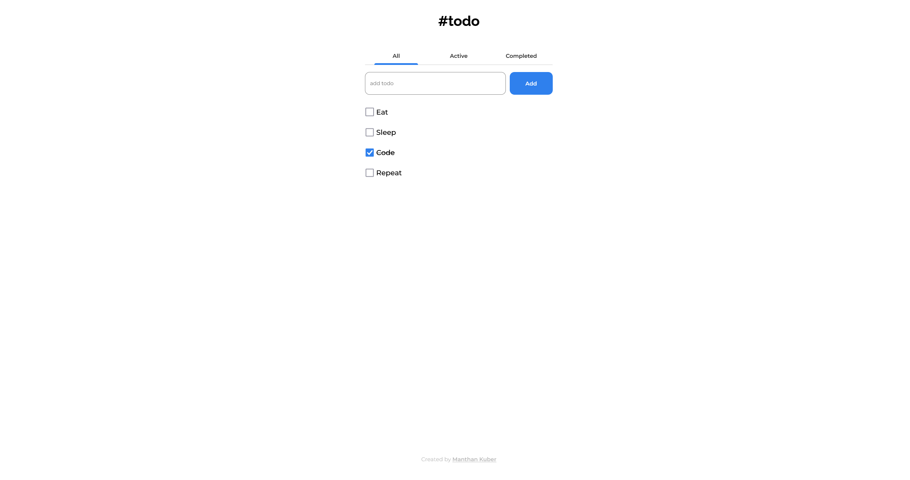
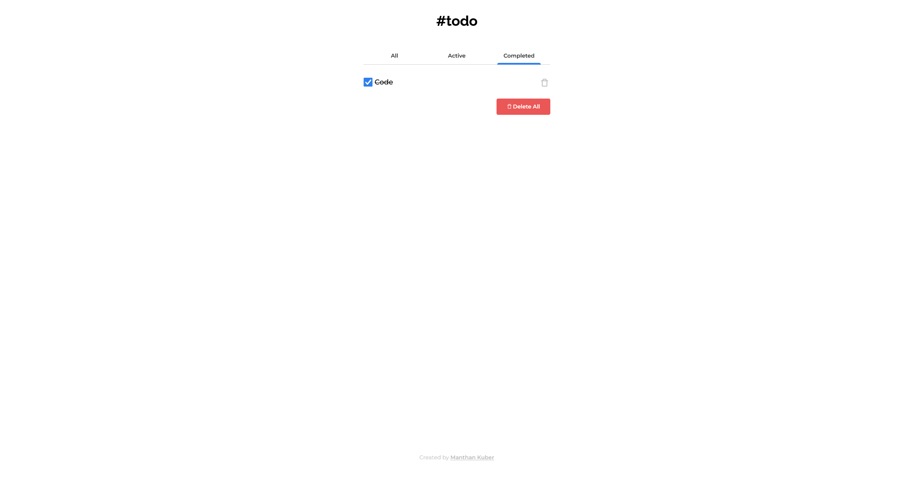
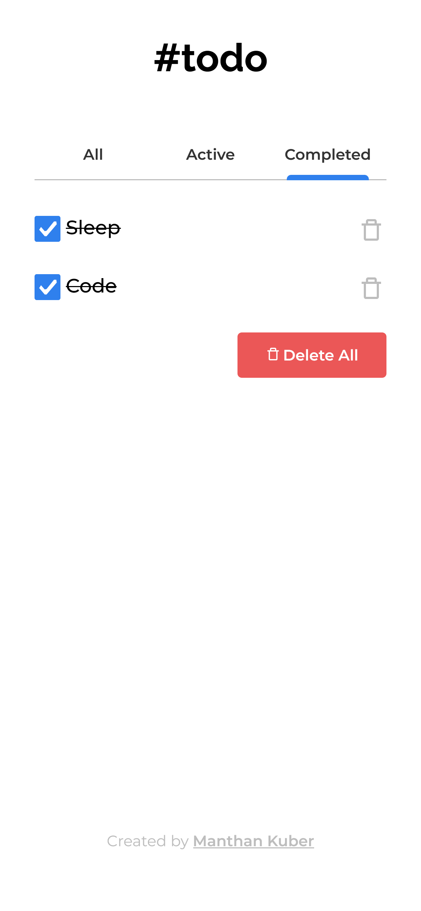

<h1 align="center">Todo App</h1>

A Todo App which allows you to add & delete todos. It stores your todos in localStorage of your browser so that they won't be deleted on page refresh or session end

<!-- Please update value in the {}  -->

  <h3>
    <a href="https://manthan-kuber.github.io/todo-app/">
      Live Demo
    </a>
     | 
    <a href="https://devchallenges.io/challenges/hH6PbOHBdPm6otzw2De5">
      Challenge
    </a>
  </h3>

<!-- TABLE OF CONTENTS -->

## Table of Contents

- [Overview](#overview)
- [Learnings](#learnings)
- [Contact](#contact)

<!-- OVERVIEW -->

## Overview

Desktop Screenshot

Mobile Screenshot

This application/site was created as a submission to a [DevChallenges](https://devchallenges.io/challenges) challenge. The [challenge](https://devchallenges.io/challenges/hH6PbOHBdPm6otzw2De5) was to build an application to complete the given user stories.

### Built With

<!-- This section should list any major frameworks that you built your project using. Here are a few examples.-->

- [React](https://reactjs.org/)
- [Redux](https://redux.js.org/)
- [ReduxToolkit](https://redux-toolkit.js.org/)
- [StyledComponents](https://styled-components.com/)
- [FramerMotion](https://www.framer.com/motion/)

## Learnings

- Learned Typescript
- Learned about Redux fundamentals
- Learned about configuring Redux in React using react-redux and redux toolkit
- Learned about persisted reducers
- Learned about animations in framer motion

## Contact

- GitHub [@Manthan-Kuber](https://github.com/Manthan-Kuber)
